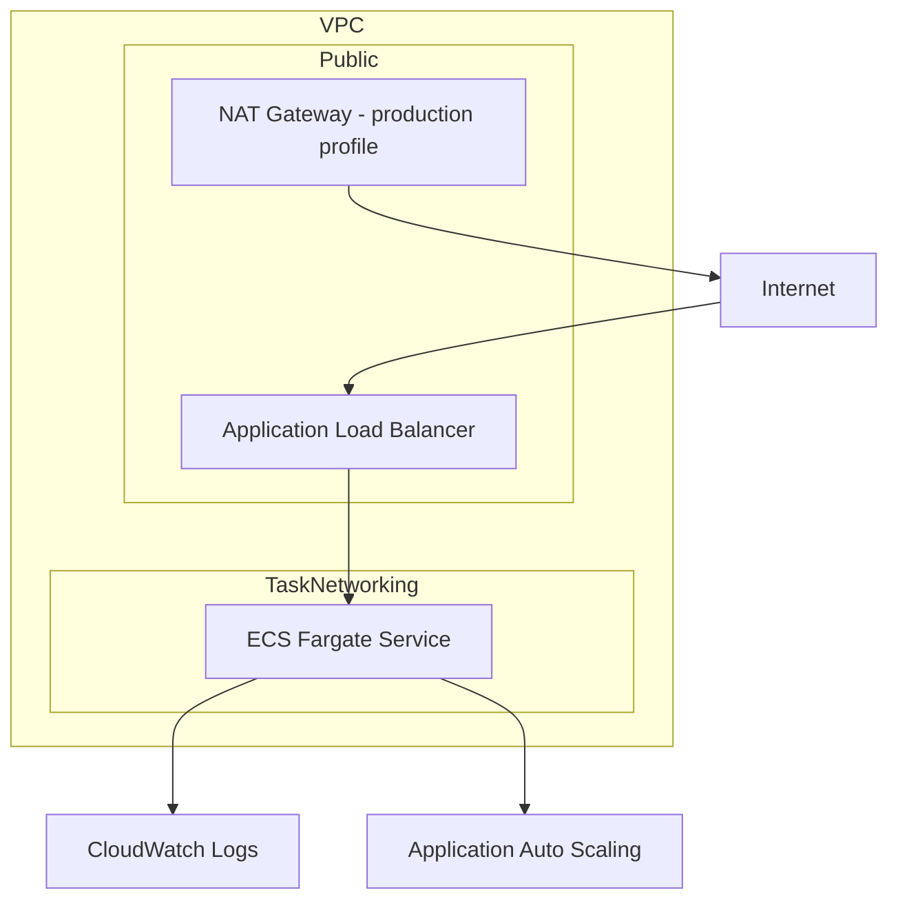

# CloudForge Architecture

CloudForge is a reusable Terraform portfolio project that models a container-ready AWS platform using infrastructure as code.

## Architecture

## Network module

The `modules/network` module creates:

- one VPC;
- DNS support and hostnames;
- public and private subnets across at least two availability zones;
- an internet gateway;
- public route table;
- private route table;
- optional NAT gateway and Elastic IP.

The NAT gateway is configurable because it improves private-workload networking but also creates recurring AWS cost.

## ECS service module

The `modules/ecs_service` module creates:

- ECS cluster;
- Fargate task definition;
- ECS service;
- Application Load Balancer;
- target group and listener;
- load-balancer security group;
- task security group;
- execution IAM role;
- CloudWatch log group;
- target-tracking CPU autoscaling.

Security-sensitive defaults include:

- tasks receive traffic only from the ALB security group;
- ECS task root filesystem is read-only;
- tasks do not receive a public IP unless the selected environment explicitly requires it;
- invalid ALB headers are dropped;
- ECS deployment circuit breaker and rollback are enabled.

## Environment strategy

The root module is driven by tfvars files.

### Development

`env/dev.tfvars` intentionally avoids a NAT gateway. ECS tasks are placed in public subnets and receive public IPs so the example remains cheaper to deploy for short-lived experiments.

### Production example

`env/prod.tfvars` enables NAT and runs ECS tasks in private subnets. It also demonstrates a larger autoscaling range and longer log retention.

The production file is an example architecture profile, not a recommendation to apply it unchanged.

## State strategy

No remote backend is enabled automatically because CI and portfolio visitors should not require an AWS account.

`backend.hcl.example` documents an S3 + DynamoDB remote-state pattern for real deployments.

## Validation and tests

CloudForge uses several quality gates:

1. `terraform fmt -check -recursive`
2. `terraform validate`
3. `terraform test` with a mocked AWS provider
4. TFLint

The Terraform tests verify both the dev and production network modes without authenticating to AWS or creating real resources.

## CI safety

GitHub Actions never runs `terraform apply`.

The CI workflow only initializes providers, validates HCL, executes mocked plans/tests, and performs linting.

## Future improvements

Production-oriented extensions could include:

- ACM certificates and HTTPS-only listeners;
- Route 53 records;
- WAF;
- VPC endpoints to reduce NAT dependency;
- ECR;
- Secrets Manager integration;
- RDS/Aurora;
- S3 state bootstrap module;
- OpenTelemetry;
- blue/green ECS deployments;
- policy-as-code using OPA/Conftest or Checkov.
